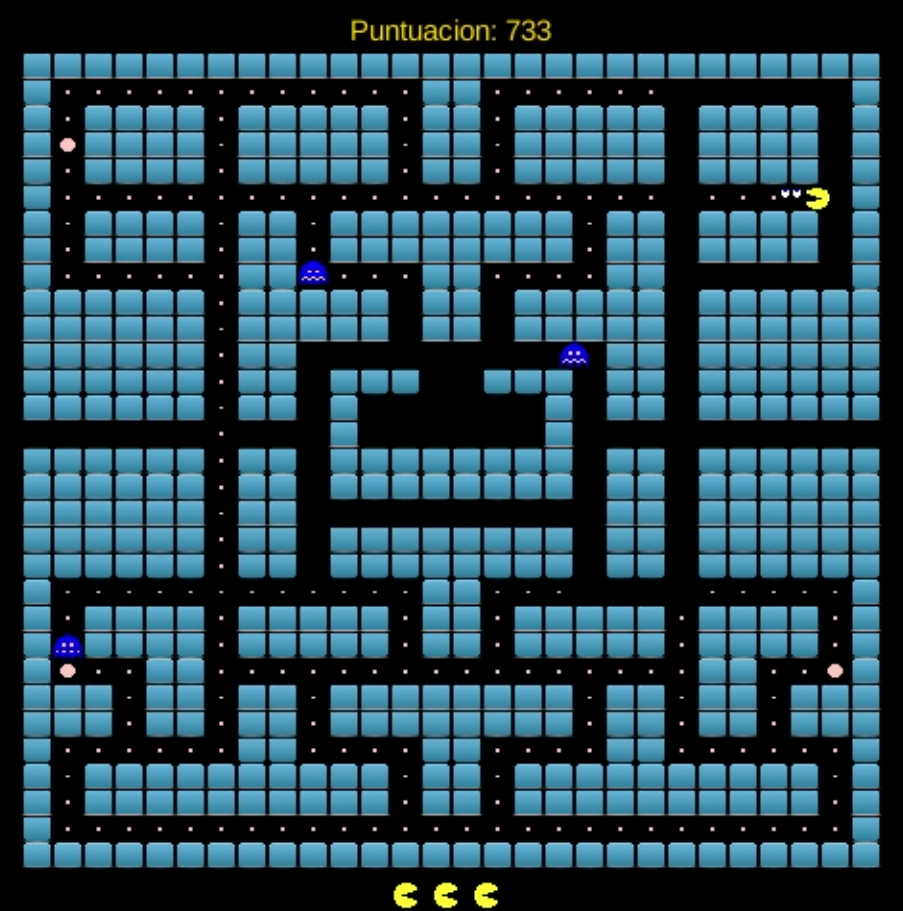

# 🟡 Pacman2 - Trabajo de Fin de Grado 🎓

Este proyecto es un videojuego tipo **Pacman**, desarrollado como **Trabajo de Fin de Grado** durante el curso 2024-2025. Utiliza el framework **LibGDX** y está completamente programado en **Java**.

## 🎮 Descripción

El juego recrea la mecánica clásica de Pacman: recorrer un laberinto, comer puntos y evitar a los fantasmas. Se ha desarrollado desde cero implementando lógica de juego, IA para los enemigos, gestión de recursos, y una arquitectura modular bien organizada.

Este proyecto no solo es una práctica de desarrollo de videojuegos, sino también un ejercicio completo de aplicación de conceptos de programación, inteligencia artificial y optimización.

## 🛠️ Tecnologías utilizadas

- **Lenguaje:** Java
- **Framework:** LibGDX
- **Mapas:** Tiled + exportación personalizada `.txt`
- **Diseño modular:** MVC (Controller, Model, View)
- **Gestión de assets:** TextureFactory y SoundManager con patrón Singleton
- **IDE usado:** Android Studio
- **Control de versiones:** Git

## 🧠 Funcionalidades destacadas

- **IA de fantasmas personalizada**, con 4 comportamientos distintos:
    - `ChasePacmanAI`: persigue a Pacman
    - `ShortestPathAI`: busca la ruta más corta
    - `RandomAI`: movimiento aleatorio
    - `AdaptiveAI`: combina estrategia y aleatoriedad

- **Sistema de colisiones** detallado entre Pacman, fantasmas y objetos
- **Renderización optimizada** con `SpriteBatch`
- **Gestión de pantallas (Loading, Game, GameOver)** usando `Screen` de LibGDX
- **Control táctil y por teclado**, con detección de gestos para móviles
- **Efectos de sonido y música**, sincronizados con los eventos del juego
- **Sistema de puntuación y vidas**, con feedback visual y sonoro

## 📁 Estructura del proyecto

```
├── controller/          # Lógica del juego (movimiento, IA)
├── model/              # Elementos del juego (Pacman, fantasmas, laberinto...)
├── view/               # Texturas y renderizado
├── screens/            # Pantallas del juego
├── assets/             # Recursos gráficos y sonoros
└── PacmanGame.java     # Clase principal
```

## 🧩 Aprendizajes y objetivos alcanzados

- Organización de un proyecto completo desde cero
- Aplicación de programación orientada a objetos en un contexto real
- Implementación de IA básica para personajes
- Gestión de recursos gráficos y sonoros
- Optimización del rendimiento en juegos 2D
- Documentación clara y estructurada

## 📸 Capturas

### Pantalla de inicio


### Vista de fantasma en juego


## 📚 Bibliografía

- [LibGDX – Documentación oficial](https://libgdx.com/dev/)
- [Tiled Map Editor](https://www.mapeditor.org/)
- [Código limpio – Robert C. Martin](https://amzn.to/3Jj3fdY)

## 📢 Sobre mí

Soy **María Hermosell**, desarrolladora junior con pasión por la programación backend (Java & .NET) y la creación de soluciones funcionales y bien estructuradas. Este proyecto refleja mi entusiasmo por aprender, construir y superarme en cada paso.

🔗 [LinkedIn](https://www.linkedin.com/in/maría-hermosell-santiago-95454858/)  
📧 mariahermosell@gmail.com

---

